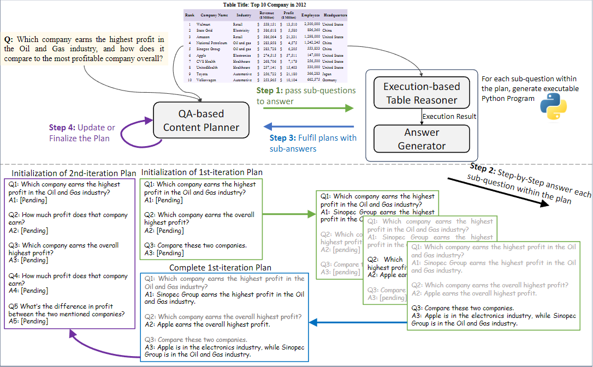

# TaPERA

## 📝 Abstract

Long-form Table Question Answering (LFTQA) requires systems to generate paragraph-long and complex answers to questions over tabular data. While Large Language Models (LLMs) have made significant progress, they often hallucinate, especially when the task involves complex reasoning over tables. To tackle this issue, we propose a new LLM-based framework, **TaPERA** (Table Planning, Execution, and Reasoning for Answering). Our framework uses a modular approach that decomposes the whole process into three sub-modules:

1.  **QA-based Content Planner**: Iteratively decomposes the input question into sub-questions.
2.  **Execution-based Table Reasoner**: Produces an executable Python program for each sub-question.
3.  **Answer Generator**: Generates a long-form answer grounded on the program output.

Human evaluation results on the FeTaQA and QTSumm datasets indicate that our framework significantly improves strong baselines on both accuracy and truthfulness, as our modular framework is better at table reasoning, and the long-form answer is always consistent with the program output. Our modular design further provides transparency as users are able to interact with our framework by manually changing the content plans.

<div align="center">

<p><em>Overview of the TaPERA framework.</em></p>
</div>

## 📊 Datasets

Our framework is evaluated on two standard Long-Form Table QA datasets. Both are publicly available on Hugging Face:

-   [**FeTaQA**](https://huggingface.co/datasets/DongfuJiang/FeTaQA): A Free-form Table Question Answering dataset that requires generating descriptive and free-form answers from Wikipedia tables.
-   [**QTSumm**](https://huggingface.co/datasets/yale-nlp/QTSumm): A Query-focused Table Summarization dataset where the goal is to generate a summary for a given query over a table.

Our code includes a pre-processing step to unify the data format for seamless execution.

## 🚀 Getting Started

### Installation

1.  Install the required dependencies:
    ```bash
    pip install -r requirements.txt
    ```

2.  Set up your OpenAI credentials:
    
    **Option A: Azure OpenAI**
    ```bash
    export AZURE_OPENAI_API_KEY="your-api-key"
    export AZURE_OPENAI_ENDPOINT="https://your-endpoint.openai.azure.com/"
    ```

    Our code is built on GPT-3.5-Turbo as the base model, but it can be seamlessly extended to support newer models such as GPT-4.1 and GPT-5.
    
    **Option B: Official OpenAI**
    ```bash
    export OPENAI_API_KEY="your-openai-api-key"
    ```
    
    Alternatively, you can create a `.env` file in the project root with these variables.

    **Option C: Open-Source LLMs**
    
    Our pipeline also supports inference with open-source models. To enable this, you should set up an OpenAI-compatible endpoint using vLLM (https://docs.vllm.ai/en/stable/getting_started/quickstart.html#openai-compatible-server).

### Running the TaPERA Pipeline

The process consists of two main steps: generating the answers with TaPERA and then evaluating the generated outputs against the ground truth.

#### Step 1: Generate Answers

This step runs the full TaPERA pipeline to generate long-form answers for the questions in the specified dataset.

```bash
# Example for running on 10 samples from the QTSumm test set
python run_llm.py \
    --model "gpt-35-turbo" \
    --dataset_name "yale-nlp/QTSumm" \
    --split_name "test" \
    --n_samples 10 \
    --output_path "outputs"
```
-   To run on the entire dataset, set `--n_samples` to `-1`.
-   This will create an output file, e.g., `outputs/QTSumm_output/QTSumm_test_gpt-35-turbo_output.jsonl`.
-   This file contains the `prediction`, `ground_truth`, and detailed `log_data` for full interpretability.

#### Step 2: Evaluate Results

This step uses the `eval.py` script to calculate a suite of metrics comparing the generated predictions with the ground-truth references.

```bash
# Run evaluation on the generated outputs
python eval.py
```
The script is pre-configured to find the output files generated in Step 1 for both `FeTaQA` and `QTSumm`. It will print a formatted table of results to the console, including:
-   sacreBLEU
-   Rouge-L
-   METEOR
-   BERTScore
-   TAPAS-Acc
-   AutoACU
-   Average Prediction Length

## 📚 Citation

If you find TaPERA useful in your research, please cite our paper:

```bibtex
@inproceedings{zhao-etal-2024-tapera,
    title = "{T}a{PERA}: Enhancing Faithfulness and Interpretability in Long-Form Table {QA} by Content Planning and Execution-based Reasoning",
    author = "Zhao, Yilun  and
      Chen, Lyuhao  and
      Cohan, Arman  and
      Zhao, Chen",
    editor = "Ku, Lun-Wei  and
      Martins, Andre  and
      Srikumar, Vivek",
    booktitle = "Proceedings of the 62nd Annual Meeting of the Association for Computational Linguistics (Volume 1: Long Papers)",
    month = aug,
    year = "2024",
    address = "Bangkok, Thailand",
    publisher = "Association for Computational Linguistics",
    url = "https://aclanthology.org/2024.acl-long.692/",
    doi = "10.18653/v1/2024.acl-long.692",
    pages = "12824--12840"
}
```